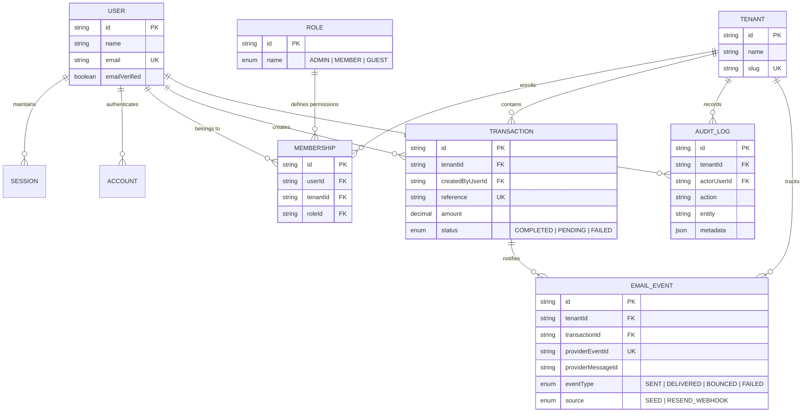
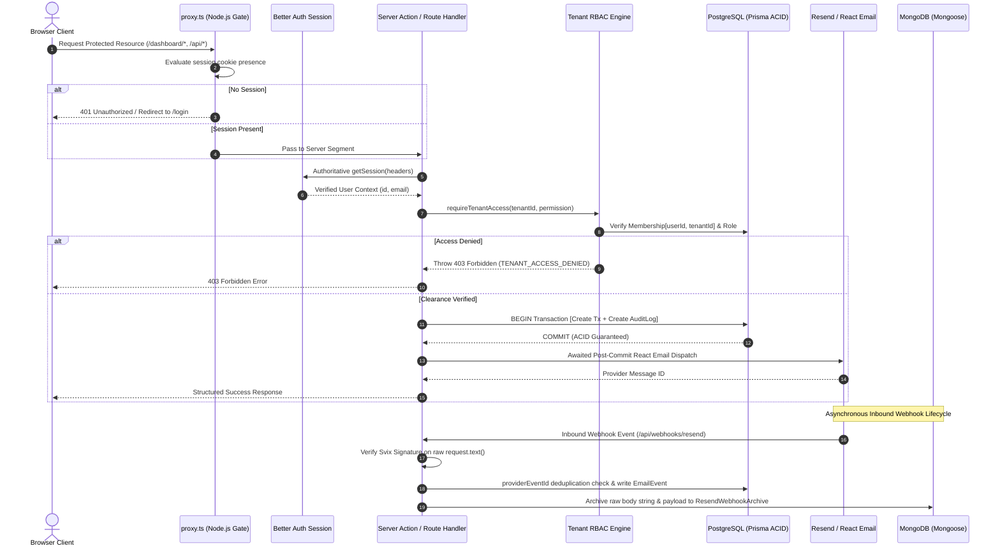

# ASSIGNMENT 2: SYSTEM ARCHITECTURE & VERIFICATION NOTE
**Department:** Artificial Intelligence and Machine Learning | **Course:** Fullstack Development with Next.js (DJS23AMD302)  
**Project:** SecureOps — Multi-Tenant Relational Seeding, Event Notification & Secure Full-Stack Endpoints  
**Course Outcomes:** CO3 (Better Auth Session & Proxy RBAC) & CO4 (Prisma PostgreSQL & Mongoose MongoDB)

---

## 1. RELATIONAL & OBJECT DATA ARCHITECTURE

SecureOps implements a normalized relational database design via **Prisma ORM (PostgreSQL)** paired with an asynchronous document archive via **Mongoose ODM (MongoDB)**.



### Dual-Database Distinction (CO4 Fulfillment)
1. **PostgreSQL / Prisma ORM (Authoritative)**: Strictly normalized relational models maintaining ACID transactions, foreign-key integrity, multi-tenant boundaries, and structured audit trails.
2. **MongoDB / Mongoose ODM (Raw Archive)**: Stores unmutated raw webhook event bodies (`rawBody`), parsed JSON structures, and ingestion metrics in `ResendWebhookArchive`.

---

## 2. DEFENSE-IN-DEPTH AUTHORIZATION & PROXY RBAC (CO3)

SecureOps implements strict zero-trust multi-tier authorization. No client-provided user IDs, tenant identifiers, or role claims are ever trusted.



---

## 3. TRANSACTIONAL NOTIFICATION & WEBHOOK LIFECYCLE

```
[Prisma ACID Mutation]
  BEGIN
    INSERT INTO "transaction" (id, reference, amount, status) VALUES ('tx_101', 'TX-781923', 5000.00, 'COMPLETED');
    INSERT INTO "audit_log" (action, entity, actorUserId) VALUES ('TRANSACTION_CREATED', 'Transaction', 'usr_admin');
  COMMIT;
      │
      ▼
[Awaited Resend Dispatch] 
  --> Render React Email template: TransactionAlertEmail.tsx
  --> Resend API Response: { id: "msg_98f12a", status: "success" }
      │
      ▼
[Svix Webhook Delivery] (/api/webhooks/resend)
  --> Validate Headers: svix-id, svix-timestamp, svix-signature with request.text()
  --> PostgreSQL Check: Check if providerEventId 'evt_39210' exists (Idempotency)
  --> PostgreSQL Write: INSERT INTO "email_event" (eventType='DELIVERED', source='RESEND_WEBHOOK')
  --> MongoDB Mongoose: Upsert ResendWebhookArchive { providerEventId, rawBody, processingStatus='PROCESSED' }
```

### Verified Local Demo Credentials
- **Admin**: `admin@secureops.dev` / `SecureOps123!` (Full Tenant Management & Audit Logs)
- **Member**: `member@secureops.dev` / `SecureOps123!` (Create & Inspect Transactions)
- **Guest**: `guest@secureops.dev` / `SecureOps123!` (Read-only metrics, mutation restricted)
